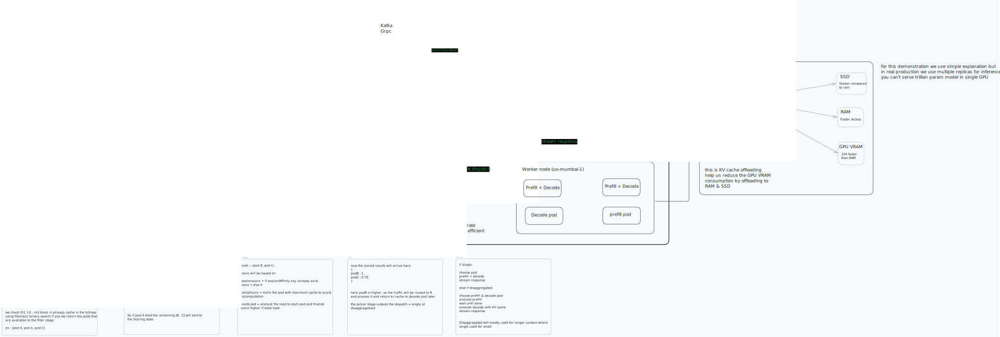

# Cache-Aware Routing Microbench

Tiny std-only Rust benchmark for the router hot path:

- tokenise prompt
- build cumulative prefix hashes
- look up `block_hash -> HostBitmap`
- mask with alive pods
- binary-search longest prefix match
- pick a mock pod
- call local mock functions, not TCP servers

No pods listen on ports. No HTTP. No async runtime. No serde/clap/tokio/hyper.

## Run

Cargo requires `--` before binary arguments:

```bash
cargo run -- --single "the cat sat on the table" --hits 1000
cargo run -- --disaggregated "the cat sat on the table" --hits 1000
cargo run -- bench-part2-query --iterations 100000 --pods 64 --blocks 32 --dropoffs 4
cargo run -- bench-part2-compare --iterations 100000 --pods 64 --blocks 32 --dropoffs 4
cargo run -- bench-part2-shards --chains 10000 --blocks-per-chain 64
cargo run -- bench-part2-concurrency --readers 8 --writers 2 --duration-secs 10 --pods 64 --blocks 32
```

If you run the compiled binary directly:

```bash
target/debug/cache-aware-routing --single "the cat sat on the table" --hits 1000
target/debug/cache-aware-routing --disaggregated "the cat sat on the table" --hits 1000
```

## Part 2 Data-Layer Benchmark

This benchmark follows Modular Part 2 exactly:

1. Storage: HostBitmap
   blockHash -> HostBitmap, where HostBitmap is a fixed 256-bit bitmap.
2. Concurrency: sharded index
   256 shards, each holding HashMap<BlockHash, HostBitmap> behind its own lock.
3. Fibonacci hashing
   shard = top bits of hash * 0x9E3779B97F4A7C15.
   Compared against low-bit sharding to show distribution quality.
4. Prefix query with binary search
   Given a cumulative hash chain, find each pod's longest cached prefix.
   Binary query is compared against naive N x P scanning.

We do not benchmark mock execution here because the mock pod sleeps for 100ms.
The goal is to prove the data-layer query path stays in microseconds.

## Why HostBitmap

`HostBitmap` is exactly `[u64; 4]`, covering 256 pods. Intersecting cache owners with alive pods or role candidates is just four `u64` operations.

## Why Cumulative Hashes

The index stores cumulative prefix hashes, not random block hashes. Prefix `k` represents the full prompt prefix up to block `k`, so a match means the pod can reuse that whole prefix.

## Files

```text
src/main.rs     CLI and minimal mock routing
src/bench_part2.rs  Modular Part 2 data-layer benchmark commands
src/bitmap.rs   fixed-size HostBitmap
src/hash.rs     deterministic FNV-1a prompt hashing
src/indexer.rs  sharded block index and prefix binary search
src/metrics.rs  latency summaries and stable metric printing
src/types.rs    tiny pod/result types
src/tests.rs    focused tests
``` 
## System design 

 